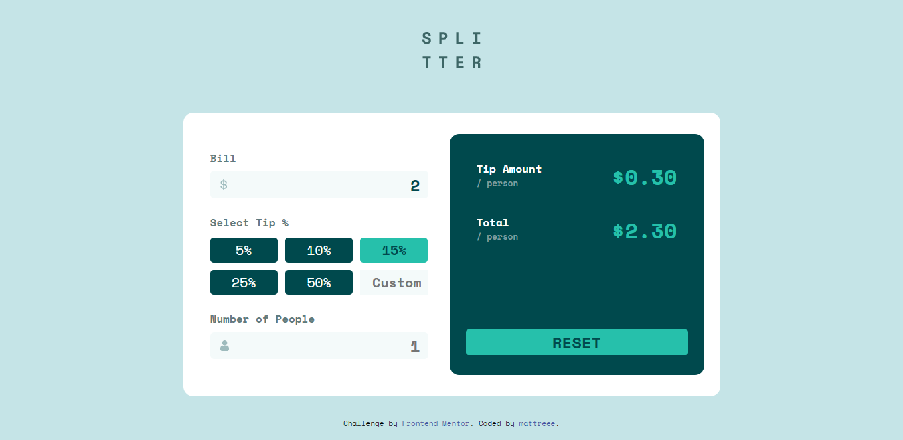

# Frontend Mentor - Tip calculator app solution

This is a solution to the [Tip calculator app challenge on Frontend Mentor](https://www.frontendmentor.io/challenges/tip-calculator-app-ugJNGbJUX). Frontend Mentor challenges help you improve your coding skills by building realistic projects.

## Table of contents

- [Overview](#overview)
  - [The challenge](#the-challenge)
  - [Screenshot](#screenshot)
  - [Links](#links)
- [My process](#my-process)
  - [Built with](#built-with)
  - [Continued development](#continued-development)
- [Author](#author)

## Overview

### The challenge

Users should be able to:

- View the optimal layout for the app depending on their device's screen size
- See hover states for all interactive elements on the page
- Calculate the correct tip and total cost of the bill per person

### Screenshot

### Links

- Live Site URL: [Live on Vercel](https://tip-calculator-app-frontend-mentor-iota.vercel.app/)

## My process

### Built with

- Semantic HTML5 markup
- Flexbox
- CSS Grid
- [React](https://reactjs.org/)
- [Sass](https://sass-lang.com/)

### Continued development

A lot of the interactivity of the project was done with pure JavaScript, since I'm still diving into React and Sass. It Just felt more practical to do it with JS, but I plan to focus more on adding react's hooks and sass' mixins in my next projects.

## Author

- Frontend Mentor - [mattreee](https://www.frontendmentor.io/profile/mattreee)
- CodePen - [asdjkl123](https://codepen.io/asdjkl123)
